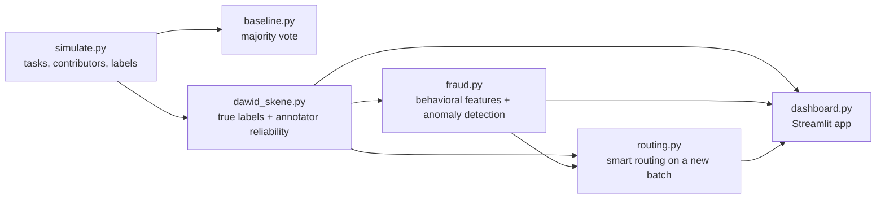

# LabelGuard

**Quality control, fraud detection, and smart task routing for crowdsourced AI training data.**

LabelGuard simulates a crowdsourced data-labeling platform and builds the three systems such platforms depend on: estimating which annotators to trust, detecting and removing bad actors, and routing tasks so that labels are both more accurate and cheaper to collect.

  

---

## Table of contents

- [Why this matters](#why-this-matters)
- [Headline results](#headline-results)
- [Pipeline overview](#pipeline-overview)
- [1. Simulating the platform](#1-simulating-the-platform)
- [2. Baseline: majority vote](#2-baseline-majority-vote)
- [3. Quality estimation: Dawid-Skene](#3-quality-estimation-dawid-skene)
- [4. Fraud detection](#4-fraud-detection)
- [5. Smart routing and adaptive stopping](#5-smart-routing-and-adaptive-stopping)
- [6. Interactive dashboard](#6-interactive-dashboard)
- [Design decisions](#design-decisions)
- [Limitations](#limitations)
- [Getting started](#getting-started)
- [Project structure](#project-structure)
- [Roadmap](#roadmap)

---

## Why this matters

Modern AI models are trained and fine-tuned on data labeled by people: classifying images, judging whether text is toxic, or choosing which of two chatbot answers is better (the preference data behind RLHF). Large labeling platforms coordinate hundreds of thousands of contributors, and they face three recurring problems:

1. **Annotators vary in quality.** Some are careful experts; others make frequent mistakes.
2. **Some annotators cheat.** Bots click random answers, low-effort workers always pick the same option, and fraud rings share answer keys to collect payment without doing the work.
3. **Every label costs money.** Asking five people per task is expensive, and wasted on tasks where two careful people already agree.

Noisy labels flow directly into the models trained on them. LabelGuard addresses all three problems in one pipeline and measures each step against known ground truth.

---

## Headline results

| Component | Result |
|---|---|
| **Quality estimation** | Label accuracy **79.8% → 82.9%** over majority vote, using no ground truth |
| **Fraud detection** | **40 / 40** bad actors caught, **89% precision**, 100% recall |
| **Smart routing** | Accuracy **82% → 91%** while using **36% fewer labels** per task |


---

## Pipeline overview



Each stage reads the previous stage's output (CSV files) and writes its own, so stages can be rerun independently.

---

## 1. Simulating the platform

**File:** `simulate.py`

Real labeling data with confirmed cheaters is rarely public, and real platforms never know the true answer to every task. Simulating the platform makes it possible to grade every method against ground truth that the methods themselves never see.

**Tasks.** 2,000 binary labeling tasks, each with a hidden true label and a difficulty drawn from a Beta(2, 5) distribution (most tasks easy, a long tail of hard ones). 5% of tasks are marked as gold questions with known answers.

**Contributors.** 200 annotators across four behavioral types:

| Type | Count | Behavior | Median time per task |
|---|---|---|---|
| Honest | 160 | Accuracy drawn from 70–97%, reduced on harder tasks | 28.4 s |
| Lazy | 15 | Always selects the first option | 6.0 s |
| Bot | 15 | Answers uniformly at random | 1.6 s |
| Colluder | 10 | Copies a shared answer key, independent of the truth | 11.7 s |

**Labels.** Each task is assigned to 5 randomly chosen contributors, producing 10,000 labels with a recorded answer and completion time.

The contributor `kind` column is hidden from every downstream method and used only for evaluation.

---

## 2. Baseline: majority vote

**File:** `baseline.py`

The simplest aggregation: each task takes the label chosen by most of its 5 annotators.

**Result: 79.8% accuracy.** This is the reference number every later method must beat.

Majority vote's weakness is that it treats every vote equally. A bot's random click counts as much as a careful expert's answer, and three low-quality votes outvote two excellent ones.

---

## 3. Quality estimation: Dawid-Skene

**File:** `dawid_skene.py`

Dawid-Skene (1979) is a classic expectation-maximization (EM) algorithm that jointly estimates two unknowns without any ground truth: the true label of each task, and the reliability of each annotator.

Each annotator $j$ is modeled by a **confusion matrix** $\pi^{(j)}_{k\ell}$, the probability they answer $\ell$ when the true label is $k$. The algorithm alternates two steps until the estimates stop changing:

**E-step: estimate true labels.** For each task $i$, compute the posterior over its true label given every annotator's answer and their current confusion matrices:

$$
P(y_i = k \mid \text{labels}) \;\propto\; p_k \prod_{j \in \text{annotators}(i)} \pi^{(j)}_{k,\,\ell_{ij}}
$$

**M-step: estimate annotator reliability.** Re-estimate each confusion matrix and the class prior $p_k$ from the current soft labels:

$$
\pi^{(j)}_{k\ell} \;=\; \frac{\sum_{i} P(y_i = k)\,\mathbb{1}[\ell_{ij} = \ell]}{\sum_{i} P(y_i = k)}
$$

The implementation is vectorized NumPy (`np.add.at`), initialized from majority vote, with light smoothing to avoid zero probabilities.

**Results**

| Method | Accuracy |
|---|---|
| Majority vote | 79.8% |
| **Dawid-Skene** | **82.9%** |

The per-annotator estimates closely track reality, even though the algorithm never saw the true labels or contributor types:

| Contributor type | True accuracy | Estimated accuracy |
|---|---|---|
| Honest | 73.1% | 74.1% |
| Bot | 48.3% | 49.9% |
| Colluder | 50.5% | 49.4% |
| Lazy | 49.5% | 47.9% |

Nine of the ten lowest-rated contributors are planted bad actors.

---

## 4. Fraud detection

**File:** `fraud.py`

Quality scores alone can't separate fraud from honest low skill, and colluders partly evade Dawid-Skene because they agree with one another. Fraud detection therefore adds behavioral signals, much like card-fraud systems look at *how* a transaction happens rather than only its outcome.

**Features per contributor**

| Feature | What it catches |
|---|---|
| Median seconds per task | Bots and rushed workers |
| Standard deviation of task time | Unnaturally uniform, automated timing |
| Agreement with Dawid-Skene consensus | Random or adversarial answers |
| Entropy of the label distribution | Workers who always pick the same option |
| Dawid-Skene estimated accuracy | Overall reliability |

**Detection layers**

1. **Explainable rules.** Flag a contributor whose median time is below 50% of the platform-wide median, or whose label entropy is below 0.3 bits.
2. **Anomaly detection.** An Isolation Forest (scikit-learn, 10% contamination) on the standardized features catches behavior the rules don't describe. Isolation Forests identify points that are easy to separate from the rest of the data using random splits.

A contributor is flagged if any layer fires. Every flag is stored with its reason, so a human reviewer can see *why* an account was flagged.

**Results**

| Metric | Value |
|---|---|
| Contributors flagged | 45 |
| Bad actors caught | **40 / 40** (all bots, lazy workers, and colluders) |
| Honest contributors wrongly flagged | 5 |
| Precision / recall | **0.89 / 1.00** |
| Majority vote after removing flagged accounts | 82.2% |

---

## 5. Smart routing and adaptive stopping

**File:** `routing.py`

The previous steps clean up labels after they're collected. Routing asks a more valuable question: using what we've learned about contributors, can we collect better labels in the first place, for less money?

The experiment replays labeling on a **fresh batch of 2,000 tasks** the system has never seen, simulating contributor answers with the same behavioral model, and compares strategies on accuracy and cost (labels paid for per task).

**Smart routing combines three ideas:**

1. **Exclusion.** Accounts flagged by fraud detection receive no tasks.
2. **Skill-based assignment.** Each task goes to the highest-rated available contributors, using Dawid-Skene reliability estimates. A **capacity limit of 100 tasks per contributor** prevents the unrealistic outcome of routing everything to the single best annotator.
3. **Adaptive stopping.** Votes are combined as a reliability-weighted log-odds score, where a contributor with estimated accuracy $a$ contributes $\pm\log\frac{a}{1-a}$. Labeling stops as soon as the posterior confidence $\sigma(|\text{score}|)$ exceeds a threshold (minimum 2 labels, maximum 7). Easy tasks finish early; contested tasks get more opinions.

**Results**

| Strategy | Accuracy | Labels per task |
|---|---|---|
| Random assignment, 5 labels | 82.4% | 5.00 |
| Remove fraudsters, random, 5 labels | 86.9% | 5.00 |
| Smart routing, stop at 90% confidence | 90.4% | 2.83 |
| **Smart routing, stop at 95% confidence** | **91.0%** | **3.20** |
| Smart routing, stop at 99% confidence | 93.0% | 4.69 |

At the 95% threshold, smart routing improves accuracy by 8.6 points while cutting labeling cost by 36%. The threshold is a direct dial between cost and quality: a platform could set it per customer depending on their budget and accuracy requirements.

---

## 6. Interactive dashboard

**File:** `dashboard.py`

A Streamlit app that brings the results together:

- **Headline metrics:** label accuracy, bad actors caught, routed accuracy, and cost saved.
- **Contributors tab:** a scatter plot of speed against estimated accuracy, colored by status (OK, low quality, flagged), with a sortable leaderboard.
- **Flagged accounts tab:** every flagged contributor with a plain-English reason, such as "too fast (1.5s median)".
- **Cost vs. accuracy tab:** each routing strategy plotted on accuracy against labels per task.
- **Task explorer tab:** tasks where Dawid-Skene is least confident, filterable by a confidence threshold. These are the tasks a real platform would escalate to expert review.

A "reveal hidden type" toggle shows the true contributor types, so a viewer can check the flags against reality.

---

## Design decisions

**Low quality is not fraud.** An early version flagged everyone with estimated accuracy below 60% and wrongly accused 32 honest contributors. Some honest people are simply less skilled, and banning them harms both the workers and the platform's supply of labor. The final system flags fraud only on behavioral evidence and reports honest low-skill contributors separately (24 in this run) as candidates for training or easier tasks.

**Unsupervised by design.** None of the methods use ground truth or contributor types. Real platforms don't have either at scale, so every method uses only information a real platform would have: answers, timing, and agreement patterns.

**Explainability over black boxes.** Fraud flags come with human-readable reasons. On a real platform, flagged accounts are reviewed and appealed, and a flag nobody can explain is hard to act on fairly.

**Capacity constraints in routing.** Without them, "send every task to the best annotator" trivially wins in simulation and fails in reality.

---

## Limitations

- **Simulated data.** Results show that the methods work under a controlled behavioral model. Real annotator behavior is messier: skill varies by topic, people improve over time, and fraudsters adapt to detection.
- **Binary tasks.** The simulation uses two-class labels. Dawid-Skene generalizes to more classes, but the other components haven't been tested there.
- **Static skill estimates.** Routing uses reliability estimated from historical data. New contributors with no history are not handled; an online learning approach (see roadmap) would address this.
- **Colluders are easy to spot here.** The simulated fraud ring has a distinctive speed profile. A more sophisticated ring that mimics honest timing would need signals such as pairwise answer similarity.

---

## Getting started

**Requirements:** Python 3.10 or newer.

```bash
git clone https://github.com/saratheiranian/labelguard.git
cd labelguard

python -m venv venv
source venv/bin/activate          # Windows: venv\Scripts\activate
pip install -r requirements.txt
```

**Run the pipeline in order:**

```bash
python simulate.py       # creates tasks.csv, contributors.csv, labels.csv
python baseline.py       # majority-vote accuracy
python dawid_skene.py    # creates tasks_ds.csv, contributors_ds.csv
python fraud.py          # creates fraud_report.csv
python routing.py        # creates routing_results.csv (takes ~15 seconds)
```

**Launch the dashboard:**

```bash
python -m streamlit run dashboard.py
```

It opens at http://localhost:8501. All random processes use fixed seeds, so results are reproducible.

---

## Project structure

```
labelguard/
├── simulate.py          # Platform simulation: tasks, contributors, labels
├── baseline.py          # Majority-vote baseline
├── dawid_skene.py       # EM-based label and annotator-reliability estimation
├── fraud.py             # Behavioral features, rules, Isolation Forest
├── routing.py           # Skill-based routing with adaptive stopping
├── dashboard.py         # Streamlit dashboard
├── docs/                # Screenshots used in this README
├── requirements.txt
└── README.md
```

Generated CSV files are excluded from version control and recreated by running the pipeline.

---

## Roadmap

- **Real annotation data.** Validate on datasets with real crowd labels, such as CIFAR-10H.
- **Downstream impact.** Train a model on raw versus cleaned labels to measure how label quality affects model performance.
- **RLHF preference data.** Apply the pipeline to pairwise preference labels and measure the effect of label cleaning on reward-model accuracy.
- **Online learning for routing.** Treat contributor–task matching as a contextual bandit (for example, Thompson sampling) so the system learns new contributors' skill while routing, instead of relying only on history.
- **Embedding-based signals.** Use text embeddings to model topic-specific annotator skill and to detect copy-pasted justifications from fraud rings.

---

## Tech stack

Python · NumPy · pandas · scikit-learn · Streamlit

## Author

Built by [@saratheiranian](https://github.com/saratheiranian).
